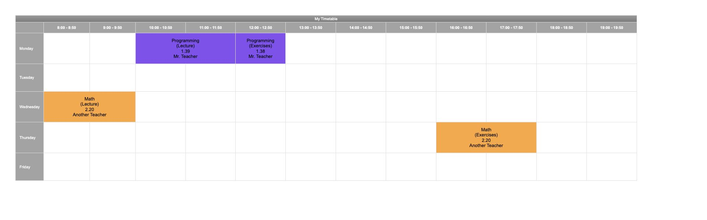

# Timetable Generator

Small react script which generates timetable from json input.



## Usage

1. Create `settings.json` according to `settings.json.example`. Specify title, days, and hours (blocks).
2. Create `input.json` according to `input.json.example`. Fill in classes, or another blocks.
3. Then, run development server and open [http://localhost:3000](http://localhost:3000)

```
npm run dev
```

## Exporting image

1. Run dev server first 

```
npm run dev
```

1. Run exporting script

```
npm run build
```
